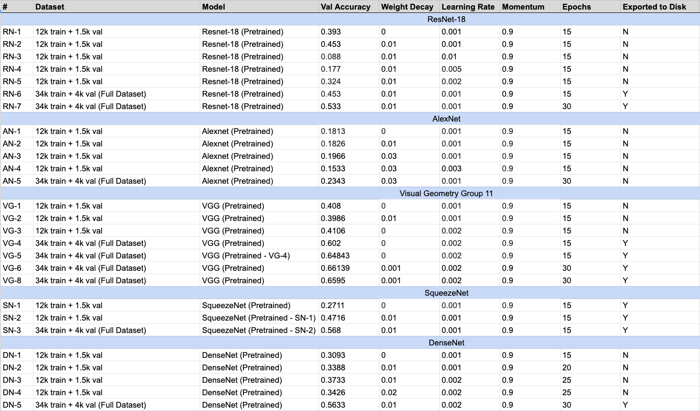
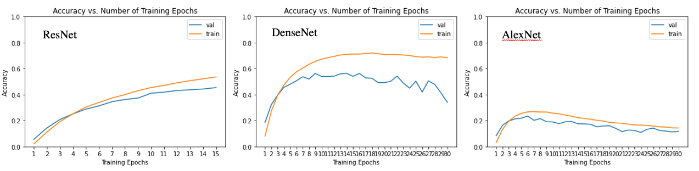
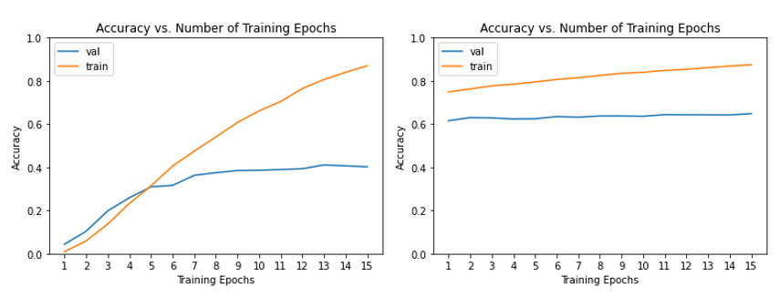
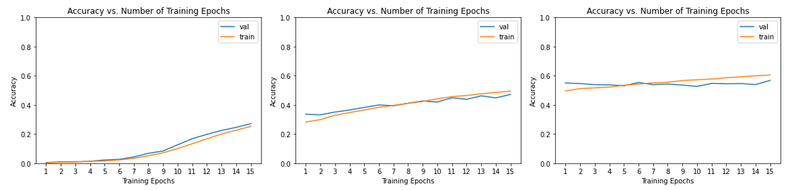
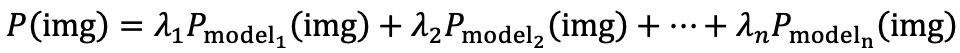
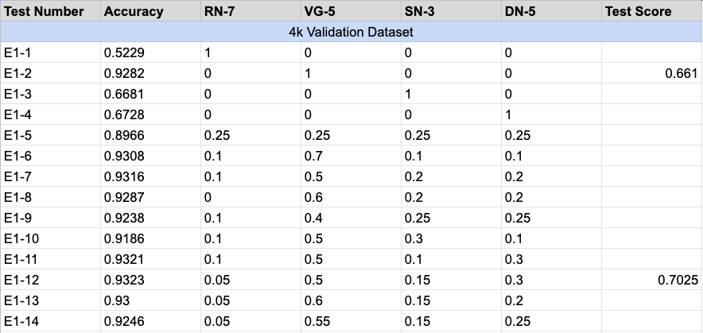
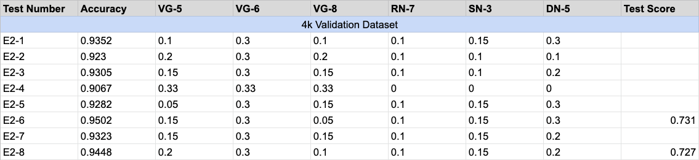

# Bird Classifier

_The project video can be found [here](https://youtu.be/y3IDvz65yxc)._

## Introduction
Welcome to my repository for my bird classifier! This is my final project for the CSE 455 Computer Vision course. The objective is to classify different types of birds given a training set of 38k images with 554 different types of birds. My goal was to build a decent classifier without using tons of computational resources and weeks of training. Below is the process I went through to build the classifier.

## Selecting and Tuning Individual Models
I began with the [PyTorch tutorial on finetuning pretrained models](https://pytorch.org/tutorials/beginner/finetuning_torchvision_models_tutorial.html). I also used the template provided by my professor Joseph Redmon for loading the birds dataset from Kaggle. I used the following five pretrained models from the tutorial: ResNet, AlexNet, VGG, SqueezeNet, and Densent. Because the full dataset was very large and took a significant amount of time to train on, I used a subset of the training data (12k for training, 1.5k for validation) to tune the hyperparameters for each model. I used this subset to find the best learning rate and weight decay while adjusting the number of epochs as necessary. Some models (such as ResNet) were very quick to train, and I got to experiment with a handful of hyperparameter combinations. Other models with many more parameters (such as SqueezeNet) took forever to train, and I ended up just re-training the same model over and over until the validation accuracy peaked without tuning the hyperparameters. After tuning the individual models, VGG scored the highest with a validation accuracy of 64.84% (VG-5), while AlexNet scored the lowest with a validation accuracy of 23.43% (AN-5). Because it was so low, I decided to not use AlexNet for the remainder of my project. Below are the results of my individual model tuning experiments as well as their train and validation accuracy graphs.

<figure class="image">
  
  <figcaption>These are all the experiments that were conducted for each individual model.</figcaption>
</figure>

<figure class="image">
  
  <figcaption>ResNet, DenseNet and AlexNet were relatively quick to train. ResNet was still going up at 15 epochs, so 30 epochs were used to train the final model. DenseNet seems to perform worse as we train it more, and AlexNet just doesn't want to perform at all.</figcaption>
</figure>

<figure class="image">
  
  <figcaption>VGG took a while to train so I decided to use the VGG model trained on the training subset and continued to train it on the entire training dataset.</figcaption>
</figure>

<figure class="image">
  
  <figcaption>SqueezeNet took a really long time to train. The first two training sets are on the subset of the training data, while the final training set is done on the entire training data. Thankfully the validation accuracy peaked off on the third run!</figcaption>
</figure>

_Note: In order for all 38k images to fit on the Google Colab disk, the images were all resized to 128x128. An easy way to increase the classifier accuracy is to encode the images at a higher resolution, and train the models with batches of the training data. However, to maximize efficiency, I kept my images at a small enough resolution so that the entire training dataset could be fit on disk._

## Ensembling with Linear Combinations
To improve the accuracy of my classifier, I decided to create an ensemble model. I wanted to use information from each model to make my final prediction. To do this, I take the normalized logits from each model's output after feeding in the same image, weigh the logits vector by some value, and sum up all of the logits vectors from all classifiers. Then, I take the argmax of the final vector to get the prediction. Formally, this can be written as:

Where each λ represents the corresponding weight for each model. The first ensemble included four models: ResNet, VGG, DenseNet, and SqueezeNet. Below are the results:

<figure class="image">
  
  <figcaption>Each model was first tested on its own. Then, I selected weights based on these accuracies. Better models received higher weights, and lower model received lower weights. With some slight adjustments, this yieled decent results.</figcaption>
</figure>

Unfortunately, the validation accuracy shown in these experiments does not represent the testing accuracy, as these models have been trained and tuned on the entire training corpus. However, with ensembling, we were able to get a 4% increase in testing accuracy (through Kaggle submissions) through ensembling with weaker models as opposed to just using the best model (VGG).

## More Ensembling
Because VGG performed so well, I decided to train two more VGG models on the entire training dataset. Each VGG model varied slightly since the training dataset was randomly split for training and validation (these two correspond to VG-6 and VG-8). 

<figure class="image">
  
  <figcaption>Optimal weights are still very similar to the previous ensemble machine.</figcaption>
</figure>

I tried to create an ensemble using only the VGG models (which performed better than the rest), but achieved a lower score compared to using all of the models in the ensemble. I suspect that each model is able to learn the data differently, and that having more weak but different models can be much more beneficial than strong but similar models. Ultimately, a similar set of weights to the previous ensemble model yielded optimal results. My final testing accuracy is 73.1%!

## Discussion

Setting up everything through Google Drive was quite a pain. The file system on Google Drive constantly crashed when loading images into my Colab notebook, requiring me to restart the runtime. Loading images also took a very long time (the 12k images loaded from drive took longer than the 38k images loaded from Kaggle via CLI). There were also times where I forgot to reset the model when tuning hyperparameters. As a result, I would get a very high validation accuracy score when it shouldn't be achieving such a high score.

I believe the ensemble approach has a very high potential. However, I restricted the performance of my models significantly by setting my image size to 128x128. If I could redo this project, I would definitely increase the image size to 256x256 so that my individual classifiers can perform much better.

## Extensions
There is a lot more that can be done here. Ensembling is a very powerful method, and I only used a handful of models without a very good understanding of the network architectures of the models. Finding different models that can help each other out can be very beneficial in an ensemble. The models I used are also not that big. With more high-resolution images and larger models, the classification accuracy can easily increase significantly. Finally, a single neural network layer can be used for the ensemble (as opposed to hand-selected weights). This means the model can learn the weight parameters and find the optimal values. With this idea, there are many more extensions possible (such as creating a neural network that takes the outputs of these 5 models as inputs). hese are just a handful of extensions that I would love to work on if more time was provided for this project.